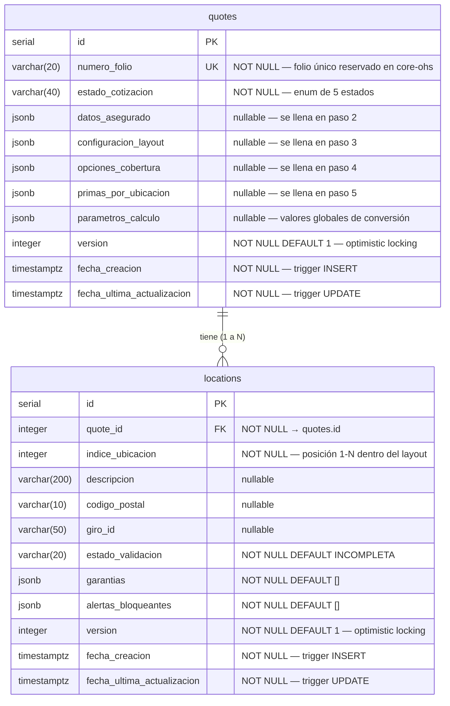

# Spec: Modelo de Datos — Sistema de Cotización de Seguros de Daños

## Metadata
- **ID**: SPEC-003
- **Fecha**: 2026-04-17
- **Estado**: DRAFT
- **Autor**: Spec Generator Agent
- **Versión**: 1.0.0
- **Relacionado con**: SPEC-001 (Requerimientos Funcionales), SPEC-002 (Arquitectura de Alto Nivel)

---

## Descripción

Este documento especifica el modelo de datos completo del sistema `cotizador-danos`. Define el diagrama entidad-relación, el diccionario de datos para todas las columnas y estructuras JSONB, y el conjunto canónico de restricciones y validaciones que garantizan la integridad referencial y de negocio en PostgreSQL. Es la fuente de verdad para la implementación de entidades TypeORM, migraciones de base de datos y contratos de validación en el backend.

---

## Requerimiento de Negocio

Documentar formalmente el modelo de datos del sistema para que:
1. Los agentes de backend tengan un contrato inequívoco al implementar entidades TypeORM y migraciones.
2. Las estructuras JSONB queden definidas con sus tipos, campos obligatorios y reglas de validación.
3. Las restricciones de base de datos (constraints, índices, triggers) sean explícitas y trazables.
4. El equipo de QA pueda generar datos de prueba válidos e inválidos a partir de este documento.

---

## Casos de Uso

### UC-01: Persistir cotización (agregado raíz)
- **Actor**: Sistema (`plataformas-danos-back`)
- **Precondición**: El folio fue reservado en `Plataforma-core-ohs`.
- **Flujo principal**:
  1. El sistema crea un registro en `quotes` con `numero_folio` único y `estado_cotizacion = EN_EDICION`.
  2. A lo largo del flujo, el sistema actualiza las columnas JSONB de forma parcial (PATCH por sección).
  3. La columna `version` se incrementa en cada `UPDATE` vía trigger.
- **Postcondición**: El registro en `quotes` refleja el estado actual del flujo multi-paso.

### UC-02: Persistir ubicaciones de riesgo
- **Actor**: Sistema
- **Precondición**: El layout fue configurado (`configuracion_layout` en `quotes` no nulo).
- **Flujo principal**:
  1. Al configurar el layout, el sistema crea `N` registros en `locations` (vacíos) asociados al `quote_id`.
  2. El agente edita cada ubicación; el sistema valida y actualiza `estado_validacion`.
  3. Una ubicación sin datos mínimos permanece en estado `INCOMPLETA` con `alertas_bloqueantes`.
- **Postcondición**: Las ubicaciones reflejan el estado de validación individual; la cotización avanza cuando corresponda.

### UC-03: Persistir resultado del cálculo
- **Actor**: Sistema
- **Precondición**: Al menos una ubicación en estado `COMPLETA`.
- **Flujo principal**:
  1. `PremiumService` ejecuta el cálculo y retorna el resultado financiero.
  2. El sistema actualiza `primas_por_ubicacion` en `quotes` en una única transacción atómica.
  3. `estado_cotizacion` pasa a `CALCULADA`.
- **Postcondición**: `quotes.primas_por_ubicacion` contiene el desglose completo; `version` se incrementa.

---

## Modelos de Datos

### Diagrama Entidad-Relación



> **Nota**: La entidad `Coverage` no tiene tabla propia. Las opciones de cobertura son datos semi-estructurados persistidos en `quotes.opciones_cobertura` (JSONB), ya que su estructura puede variar por giro y no requiere consultas relacionales directas sobre coberturas individuales.

---

### Tabla `quotes`

| Columna | Tipo PostgreSQL | TypeORM | Nullable | Default | Descripción |
|---|---|---|---|---|---|
| `id` | `SERIAL` | `@PrimaryGeneratedColumn()` | No | auto | Clave primaria técnica. No exponer en API. |
| `numero_folio` | `VARCHAR(20)` | `@Column({ unique: true })` | No | — | Identificador de negocio único. Reservado en `Plataforma-core-ohs`. |
| `estado_cotizacion` | `VARCHAR(40)` | `@Column({ type: 'varchar' })` | No | `EN_EDICION` | Estado actual del flujo. Ver enum `EstadoCotizacion`. |
| `datos_asegurado` | `JSONB` | `@Column({ type: 'jsonb', nullable: true })` | Sí | `null` | Datos del asegurado y contrato. Estructura: ver sección 4.1. |
| `configuracion_layout` | `JSONB` | `@Column({ type: 'jsonb', nullable: true })` | Sí | `null` | Número y tipo de ubicaciones configuradas. Estructura: ver sección 4.2. |
| `opciones_cobertura` | `JSONB` | `@Column({ type: 'jsonb', nullable: true })` | Sí | `null` | Arreglo de coberturas disponibles con estado seleccionada/obligatoria. Estructura: ver sección 4.3. |
| `primas_por_ubicacion` | `JSONB` | `@Column({ type: 'jsonb', nullable: true })` | Sí | `null` | Resultado financiero del cálculo. Estructura: ver sección 4.4. |
| `parametros_calculo` | `JSONB` | `@Column({ type: 'jsonb', nullable: true })` | Sí | `null` | Factores globales de conversión prima neta → prima comercial. Estructura: ver sección 4.5. |
| `version` | `INTEGER` | `@VersionColumn()` | No | `1` | Control de concurrencia optimista. Gestionado por trigger. |
| `fecha_creacion` | `TIMESTAMPTZ` | `@CreateDateColumn()` | No | trigger | Momento de creación. Gestionado por trigger `INSERT`. |
| `fecha_ultima_actualizacion` | `TIMESTAMPTZ` | `@UpdateDateColumn()` | No | trigger | Última modificación. Gestionado por trigger `UPDATE`. |

---

### Tabla `locations`

| Columna | Tipo PostgreSQL | TypeORM | Nullable | Default | Descripción |
|---|---|---|---|---|---|
| `id` | `SERIAL` | `@PrimaryGeneratedColumn()` | No | auto | Clave primaria técnica. |
| `quote_id` | `INTEGER` | `@ManyToOne(() => Quote)` | No | — | FK a `quotes.id`. Cascade delete. |
| `indice_ubicacion` | `INTEGER` | `@Column()` | No | — | Posición de la ubicación dentro del layout (1 a N). |
| `descripcion` | `VARCHAR(200)` | `@Column({ nullable: true })` | Sí | `null` | Nombre o descripción libre de la ubicación. |
| `codigo_postal` | `VARCHAR(10)` | `@Column({ nullable: true })` | Sí | `null` | Código postal validado contra `Plataforma-core-ohs`. |
| `giro_id` | `VARCHAR(50)` | `@Column({ nullable: true })` | Sí | `null` | Identificador del giro económico desde catálogo core-ohs. |
| `estado_validacion` | `VARCHAR(20)` | `@Column({ default: 'INCOMPLETA' })` | No | `INCOMPLETA` | Estado de completitud de la ubicación. Enum: `COMPLETA` \| `INCOMPLETA`. |
| `garantias` | `JSONB` | `@Column({ type: 'jsonb', default: [] })` | No | `[]` | Arreglo de garantías con tipo y suma asegurada. Estructura: ver sección 4.6. |
| `alertas_bloqueantes` | `JSONB` | `@Column({ type: 'jsonb', default: [] })` | No | `[]` | Mensajes de validación que impiden el cálculo de esta ubicación. |
| `version` | `INTEGER` | `@VersionColumn()` | No | `1` | Control de concurrencia optimista. |
| `fecha_creacion` | `TIMESTAMPTZ` | `@CreateDateColumn()` | No | trigger | Momento de creación. |
| `fecha_ultima_actualizacion` | `TIMESTAMPTZ` | `@UpdateDateColumn()` | No | trigger | Última modificación. |

---

## Diccionario de Datos — Estructuras JSONB

### 4.1 `quotes.datos_asegurado`

Objeto JSON que representa los datos generales del asegurado y del contrato. Se persiste en el paso 2 del flujo (US-002).

```typescript
interface DatosAsegurado {
  nombreAsegurado:  string;      // Razón social o nombre completo del asegurado
  rfcAsegurado:     string;      // RFC mexicano: 12 chars (PM) o 13 chars (PF)
  agenteId:         string;      // ID del agente en Plataforma-core-ohs
  suscriptorId:     string;      // ID del suscriptor en Plataforma-core-ohs
  tipoNegocio:      string;      // Segmento económico del asegurado
  giroId:           string;      // ID del giro en Plataforma-core-ohs
  vigenciaInicio:   string;      // ISO 8601 date (YYYY-MM-DD)
  vigenciaFin:      string;      // ISO 8601 date (YYYY-MM-DD). Debe ser > vigenciaInicio
}
```

| Campo | Tipo | Obligatorio | Validación |
|---|---|---|---|
| `nombreAsegurado` | `string` | Sí | Min 2 chars, Max 200 chars |
| `rfcAsegurado` | `string` | Sí | Regex RFC mexicano: `/^[A-Z&Ñ]{3,4}[0-9]{6}[A-Z0-9]{3}$/i` — 12 chars PM / 13 chars PF |
| `agenteId` | `string` | Sí | Debe existir en catálogo `Plataforma-core-ohs /agents` |
| `suscriptorId` | `string` | Sí | Debe existir en catálogo `Plataforma-core-ohs /subscribers` |
| `tipoNegocio` | `string` | Sí | Max 100 chars |
| `giroId` | `string` | Sí | Debe existir en catálogo `Plataforma-core-ohs /giros` |
| `vigenciaInicio` | `string` | Sí | Formato ISO 8601 (YYYY-MM-DD). No puede ser fecha pasada |
| `vigenciaFin` | `string` | Sí | Formato ISO 8601 (YYYY-MM-DD). Debe ser estrictamente > `vigenciaInicio` |

---

### 4.2 `quotes.configuracion_layout`

Objeto JSON que define la estructura del layout de ubicaciones. Se persiste en el paso 3 del flujo (US-003).

```typescript
interface ConfiguracionLayout {
  numeroUbicaciones: number;                      // Entero entre 1 y 50
  tipoLayout:        'UNIFORME' | 'PERSONALIZADO'; // UNIFORME: todas iguales; PERSONALIZADO: independientes
}
```

| Campo | Tipo | Obligatorio | Validación |
|---|---|---|---|
| `numeroUbicaciones` | `number` | Sí | Entero, mínimo 1, máximo 50 |
| `tipoLayout` | `'UNIFORME' \| 'PERSONALIZADO'` | Sí | Solo valores del enum |

---

### 4.3 `quotes.opciones_cobertura`

Arreglo JSON de opciones de cobertura disponibles para la cotización. Se persiste en el paso 4 del flujo (US-006).

```typescript
interface OpcionCobertura {
  codigoCobertura: string;   // Código técnico de la cobertura
  descripcion:     string;   // Texto descriptivo para la UI
  seleccionada:    boolean;  // true = cobertura activa para el cálculo
  obligatoria:     boolean;  // true = no puede deseleccionarse
}

type OpcionesCobertura = OpcionCobertura[]; // Arreglo completo (nunca parcial)
```

| Campo | Tipo | Obligatorio | Validación |
|---|---|---|---|
| `codigoCobertura` | `string` | Sí | Único dentro del arreglo; Max 20 chars |
| `descripcion` | `string` | Sí | Max 150 chars |
| `seleccionada` | `boolean` | Sí | Si `obligatoria = true`, `seleccionada` debe ser `true` |
| `obligatoria` | `boolean` | Sí | — |

---

### 4.4 `quotes.primas_por_ubicacion`

Objeto JSON con el resultado financiero del cálculo de prima. Se persiste en el paso 5 del flujo (US-007) en una única transacción atómica.

```typescript
interface ResultadoCalculo {
  primaNetaTotal:        number;                     // Suma de primasPorUbicacion[].primaNeta
  primaComercialTotal:   number;                     // Suma de primasPorUbicacion[].primaComercial
  ubicacionesExcluidas:  number[];                   // índices de ubicaciones INCOMPLETA excluidas
  primasPorUbicacion:    PrimaUbicacion[];
}

interface PrimaUbicacion {
  indiceUbicacion: number;    // Corresponde a locations.indice_ubicacion
  primaNeta:       number;    // Prima sin recargos ni IVA
  primaComercial:  number;    // Prima con derecho, recargo e IVA
  desglose:        DesgloseUbicacion;
}

interface DesgloseUbicacion {
  incendioEdificios?:     number;
  incendioContenidos?:    number;
  extensionCobertura?:    number;
  catTev?:                number;  // Catastrófico: Terremoto / Erupción Volcánica
  catFhm?:                number;  // Catastrófico: Fenómenos Hidrometeorológicos
  remocionEscombros?:     number;
  gastosExtraordinarios?: number;
  perdidaRentas?:         number;
  businessInterruption?:  number;
  equipoElectronico?:     number;
  robo?:                  number;
  dineroValores?:         number;
  vidrios?:               number;
  anunciosLuminosos?:     number;
}
```

| Campo raíz | Tipo | Obligatorio | Validación |
|---|---|---|---|
| `primaNetaTotal` | `number` | Sí | ≥ 0; 2 decimales máximo |
| `primaComercialTotal` | `number` | Sí | ≥ `primaNetaTotal` |
| `ubicacionesExcluidas` | `number[]` | Sí | Arreglo vacío si no hay exclusiones; sin duplicados |
| `primasPorUbicacion` | `PrimaUbicacion[]` | Sí | Al menos 1 elemento |
| `primasPorUbicacion[].indiceUbicacion` | `number` | Sí | Entero ≥ 1 |
| `primasPorUbicacion[].primaNeta` | `number` | Sí | ≥ 0 |
| `primasPorUbicacion[].primaComercial` | `number` | Sí | ≥ `primaNeta` |
| `primasPorUbicacion[].desglose` | `object` | Sí | Al menos un campo con valor > 0 |

---

### 4.5 `quotes.parametros_calculo`

Objeto JSON con los factores globales utilizados para convertir la prima neta en prima comercial. Provistos por `Plataforma-core-ohs /rates`.

```typescript
interface ParametrosCalculo {
  factorComercial: number;  // Multiplicador prima neta → prima comercial base
  derecho:         number;  // Monto fijo de derecho de póliza
  recargo:         number;  // Porcentaje de recargo (0.0 – 1.0)
  iva:             number;  // Tasa de IVA (ej. 0.16)
}
```

| Campo | Tipo | Obligatorio | Validación |
|---|---|---|---|
| `factorComercial` | `number` | Sí | > 0 |
| `derecho` | `number` | Sí | ≥ 0 |
| `recargo` | `number` | Sí | ≥ 0; ≤ 1 |
| `iva` | `number` | Sí | ≥ 0; ≤ 1 (típicamente 0.16) |

---

### 4.6 `locations.garantias`

Arreglo JSON de garantías asignadas a una ubicación. Cada garantía es una cobertura específica con su suma asegurada.

```typescript
interface Garantia {
  tipoGarantia:   string;   // Código del tipo de garantía (ej. 'INCENDIO_EDIFICIO')
  sumaAsegurada:  number;   // Monto máximo cubierto. Debe ser > 0
  tarifable:      boolean;  // true = válida para incluir en el cálculo de prima
}

type Garantias = Garantia[];
```

| Campo | Tipo | Obligatorio | Validación |
|---|---|---|---|
| `tipoGarantia` | `string` | Sí | Max 50 chars; único dentro del arreglo por ubicación |
| `sumaAsegurada` | `number` | Sí | Número positivo > 0; máximo 2 decimales |
| `tarifable` | `boolean` | Sí | Determinado por la existencia de `giro.claveIncendio` válida |

---

### 4.7 `locations.alertas_bloqueantes`

Arreglo JSON de mensajes de alerta que impiden incluir la ubicación en el cálculo de prima.

```typescript
type AlertasBloqueantes = string[];
// Ejemplos:
// ["Código postal no válido", "El giro no tiene clave de incendio", "Sin garantías tarifables"]
```

---

## Enumeraciones

### `EstadoCotizacion`

```typescript
enum EstadoCotizacion {
  EN_EDICION                   = 'EN_EDICION',
  DATOS_GENERALES_COMPLETOS    = 'DATOS_GENERALES_COMPLETOS',
  UBICACIONES_CONFIGURADAS     = 'UBICACIONES_CONFIGURADAS',
  COBERTURAS_SELECCIONADAS     = 'COBERTURAS_SELECCIONADAS',
  CALCULADA                    = 'CALCULADA',
}
```

Transiciones válidas (en orden secuencial):

```
EN_EDICION → DATOS_GENERALES_COMPLETOS → UBICACIONES_CONFIGURADAS → COBERTURAS_SELECCIONADAS → CALCULADA
```

Retroalimentación: si se modifica una sección anterior, el estado **no regresa** automáticamente; se mantiene el último estado alcanzado salvo que se invalide el cálculo (ver regla RN-006).

### `EstadoValidacion` (ubicación)

```typescript
enum EstadoValidacion {
  COMPLETA   = 'COMPLETA',    // CP válido + giro con claveIncendio + ≥1 garantía tarifable
  INCOMPLETA = 'INCOMPLETA',  // No cumple uno o más criterios anteriores
}
```

---

## Restricciones y Validaciones

### Restricciones de Base de Datos

| Restricción | Tabla | Tipo | Definición |
|---|---|---|---|
| `uq_quotes_numero_folio` | `quotes` | UNIQUE | `numero_folio` debe ser único en toda la tabla |
| `chk_quotes_estado` | `quotes` | CHECK | `estado_cotizacion IN ('EN_EDICION','DATOS_GENERALES_COMPLETOS','UBICACIONES_CONFIGURADAS','COBERTURAS_SELECCIONADAS','CALCULADA')` |
| `chk_quotes_version_positive` | `quotes` | CHECK | `version > 0` |
| `fk_locations_quote` | `locations` | FOREIGN KEY | `quote_id → quotes.id ON DELETE CASCADE` |
| `chk_locations_indice` | `locations` | CHECK | `indice_ubicacion >= 1` |
| `uq_locations_quote_indice` | `locations` | UNIQUE | (`quote_id`, `indice_ubicacion`) — sin duplicados de índice por cotización |
| `chk_locations_estado_val` | `locations` | CHECK | `estado_validacion IN ('COMPLETA','INCOMPLETA')` |
| `chk_locations_version_positive` | `locations` | CHECK | `version > 0` |

### Índices

| Tabla | Columna(s) | Tipo | Propósito |
|---|---|---|---|
| `quotes` | `numero_folio` | UNIQUE B-Tree | Lookup por folio (operación frecuente en cada request) |
| `quotes` | `estado_cotizacion` | B-Tree | Filtrado por estado |
| `quotes` | `datos_asegurado` | GIN | Consultas JSONB con operadores `@>`, `->>` |
| `quotes` | `opciones_cobertura` | GIN | Filtros sobre coberturas seleccionadas |
| `locations` | `quote_id` | B-Tree | Resolución de FK (JOIN frecuente) |
| `locations` | `(quote_id, indice_ubicacion)` | UNIQUE B-Tree | Acceso directo a ubicación por índice |
| `locations` | `garantias` | GIN | Consultas sobre tipos y sumas de garantías |

### Triggers de Base de Datos

| Trigger | Tabla | Evento | Acción |
|---|---|---|---|
| `trg_quotes_created_at` | `quotes` | `BEFORE INSERT` | Asigna `fecha_creacion = NOW()` si es `NULL` |
| `trg_quotes_updated_at` | `quotes` | `BEFORE UPDATE` | Actualiza `fecha_ultima_actualizacion = NOW()` |
| `trg_quotes_version` | `quotes` | `BEFORE UPDATE` | Incrementa `version = version + 1` |
| `trg_locations_created_at` | `locations` | `BEFORE INSERT` | Asigna `fecha_creacion = NOW()` |
| `trg_locations_updated_at` | `locations` | `BEFORE UPDATE` | Actualiza `fecha_ultima_actualizacion = NOW()` |
| `trg_locations_version` | `locations` | `BEFORE UPDATE` | Incrementa `version = version + 1` |

---

## Reglas de Negocio

### RN-001 — Unicidad e idempotencia del folio
`numero_folio` es el identificador de negocio. Si ya existe un registro con ese folio, el endpoint `POST /v1/quotes` retorna la cotización existente sin crear un duplicado. La constraint `uq_quotes_numero_folio` es la garantía técnica.

### RN-002 — Integridad referencial de ubicaciones
Al eliminar una cotización (`quotes`), sus ubicaciones asociadas deben eliminarse en cascada (`ON DELETE CASCADE`). No existe eliminación lógica (soft delete) en esta versión.

### RN-003 — Formato RFC mexicano
`datos_asegurado.rfcAsegurado` debe cumplir el patrón `/^[A-Z&Ñ]{3,4}[0-9]{6}[A-Z0-9]{3}$/i`:
- **Persona Moral (PM)**: 12 caracteres (3 letras + 6 dígitos fecha + 3 homoclave).
- **Persona Física (PF)**: 13 caracteres (4 letras + 6 dígitos fecha + 3 homoclave).

### RN-004 — Vigencia del contrato
`datos_asegurado.vigenciaFin` **debe ser estrictamente posterior** a `datos_asegurado.vigenciaInicio`. Violación retorna `HTTP 400`.

### RN-005 — Suma asegurada positiva
Toda garantía en `locations.garantias` debe tener `sumaAsegurada > 0`. Un valor de 0 o negativo retorna `HTTP 400`.

### RN-006 — Invalidación del cálculo previo
Si se modifican `opciones_cobertura` después de un cálculo, el sistema **limpia** `primas_por_ubicacion` (establece a `null`) en la misma transacción. El estado retrocede de `CALCULADA` a `COBERTURAS_SELECCIONADAS`.

### RN-007 — Restricción de coberturas obligatorias
Una cobertura con `obligatoria = true` no puede tener `seleccionada = false`. Intentarlo retorna `HTTP 422`.

### RN-008 — Optimistic Locking
Toda escritura concurrente que envíe un `version` diferente al registrado en BD retorna `HTTP 409 Conflict` con:
```json
{
  "error": "Conflict",
  "details": {
    "expectedVersion": <versión_enviada>,
    "currentVersion": <versión_en_BD>
  }
}
```

### RN-009 — Límite de ubicaciones
`configuracion_layout.numeroUbicaciones` debe ser un entero entre **1 y 50** (inclusivo). Fuera de rango retorna `HTTP 400`.

### RN-010 — Ajuste de ubicaciones al modificar layout
Si se reconfigura el layout con un `numeroUbicaciones` distinto al actual:
- **Si aumenta**: se crean nuevos registros vacíos en `locations` para los índices faltantes.
- **Si disminuye**: se eliminan los registros de mayor índice (cola), preservando los de menor índice ya capturados.

### RN-011 — Estado de validación de ubicación
Una ubicación pasa a `COMPLETA` únicamente cuando cumple los tres criterios simultáneamente:
1. `codigo_postal` válido según `Plataforma-core-ohs`.
2. `giro_id` con `claveIncendio` definida en el catálogo.
3. Al menos una garantía con `tarifable = true` y `sumaAsegurada > 0`.

### RN-012 — Transaccionalidad del cálculo
La escritura de `primas_por_ubicacion`, `estado_cotizacion = CALCULADA` y el incremento de `version` deben ocurrir en una **única transacción atómica**. Si alguna falla, el estado previo debe preservarse.

---

## API Endpoints

> Esta sección documenta exclusivamente los endpoints con impacto directo en el modelo de datos. El detalle completo de contratos de API se define en `SPEC-004 (API Contracts)`.

### POST /api/v1/quotes
- **Acción sobre el modelo**: Inserta registro en `quotes` con `estado_cotizacion = EN_EDICION`.
- **Restricción crítica**: Idempotente sobre `numero_folio` (RN-001).

### PATCH /api/v1/quotes/:folio/general-data
- **Acción sobre el modelo**: Actualiza `quotes.datos_asegurado` (PATCH parcial).
- **Restricción crítica**: Dispara `trg_quotes_updated_at` y `trg_quotes_version`.

### POST /api/v1/quotes/:folio/layout
- **Acción sobre el modelo**: Actualiza `quotes.configuracion_layout`; crea/ajusta registros en `locations` (RN-010).
- **Restricción crítica**: Respeta límite 1-50 ubicaciones (RN-009).

### PUT /api/v1/quotes/:folio/locations
- **Acción sobre el modelo**: Actualiza lote de registros `locations`; recalcula `estado_validacion` y `alertas_bloqueantes` por cada uno.
- **Restricción crítica**: Optimistic locking por `version` de cotización (RN-008).

### PATCH /api/v1/quotes/:folio/locations/:index
- **Acción sobre el modelo**: Actualiza un registro `locations` por `indice_ubicacion`.
- **Restricción crítica**: `sumaAsegurada > 0` en todas las garantías (RN-005).

### PUT /api/v1/quotes/:folio/coverage-options
- **Acción sobre el modelo**: Reemplaza `quotes.opciones_cobertura` completo; invalida `primas_por_ubicacion` si cambia (RN-006).
- **Restricción crítica**: Coberturas obligatorias no deseleccionables (RN-007).

### POST /api/v1/quotes/:folio/calculate
- **Acción sobre el modelo**: Escribe `quotes.primas_por_ubicacion`, `estado_cotizacion = CALCULADA` en transacción atómica (RN-012).
- **Restricción crítica**: Al menos una ubicación `COMPLETA`; al menos una cobertura `seleccionada`.

---

## Frontend

> El modelo de datos no genera componentes de UI propios. Los tipos TypeScript del frontend deben derivarse directamente de las interfaces definidas en este documento.

### Tipos frontend derivados del modelo

| Tipo | Archivo | Origen |
|---|---|---|
| `Quote` | `features/quotes/types/Quote.ts` | Mapea columnas de `quotes` (sin `id` interno) |
| `DatosAsegurado` | `features/quotes/types/Quote.ts` | Sección 4.1 de este documento |
| `ConfiguracionLayout` | `features/locations/types/Location.ts` | Sección 4.2 de este documento |
| `OpcionCobertura` | `features/coverage/types/Coverage.ts` | Sección 4.3 de este documento |
| `ResultadoCalculo` | `features/calculation/types/Calculation.ts` | Sección 4.4 de este documento |
| `Location` | `features/locations/types/Location.ts` | Mapea columnas de `locations` |
| `Garantia` | `features/locations/types/Location.ts` | Sección 4.6 de este documento |

---

## Plan de Pruebas Unitarias

### Backend — Validaciones de Entidad (Models)

- [ ] `test_quote_entity_defaults` — `version` inicia en 1; `estado_cotizacion` inicia en `EN_EDICION`
- [ ] `test_quote_entity_unique_folio_constraint` — insertar dos quotes con mismo `numero_folio` lanza `QueryFailedError`
- [ ] `test_location_entity_cascade_delete` — al eliminar un `Quote`, sus `Location` se eliminan en cascada
- [ ] `test_location_unique_quote_indice_constraint` — insertar dos locations con mismo (`quote_id`, `indice_ubicacion`) lanza error de unicidad

### Backend — Validaciones de JSONB (Services / DTOs)

- [ ] `test_datos_asegurado_rfc_formato_pm_valido` — RFC de 12 chars válido pasa validación
- [ ] `test_datos_asegurado_rfc_formato_pf_valido` — RFC de 13 chars válido pasa validación
- [ ] `test_datos_asegurado_rfc_invalido_retorna_400` — RFC con formato incorrecto retorna `400`
- [ ] `test_datos_asegurado_vigencia_fin_menor_a_inicio_retorna_400` — `vigenciaFin <= vigenciaInicio` retorna `400`
- [ ] `test_garantia_suma_cero_retorna_400` — `sumaAsegurada = 0` retorna `400`
- [ ] `test_garantia_suma_negativa_retorna_400` — `sumaAsegurada = -1` retorna `400`
- [ ] `test_configuracion_layout_numero_ubicaciones_minimo` — `numeroUbicaciones = 0` retorna `400`
- [ ] `test_configuracion_layout_numero_ubicaciones_maximo` — `numeroUbicaciones = 51` retorna `400`

### Backend — Optimistic Locking

- [ ] `test_optimistic_lock_conflict_retorna_409` — actualizar con `version` desactualizado retorna `409` con `expectedVersion` y `currentVersion`
- [ ] `test_version_incrementa_tras_update` — `version` incrementa de 1 a 2 tras primer `PATCH`

### Backend — Reglas de Negocio (RN)

- [ ] `test_rn006_calculo_invalidado_al_modificar_coberturas` — modificar `opciones_cobertura` limpia `primas_por_ubicacion`
- [ ] `test_rn007_cobertura_obligatoria_no_deseleccionable_retorna_422` — deseleccionar cobertura `obligatoria=true` retorna `422`
- [ ] `test_rn010_layout_aumento_crea_ubicaciones_vacias` — aumentar `numeroUbicaciones` de 2 a 4 crea 2 nuevas locations
- [ ] `test_rn010_layout_disminucion_elimina_ultimas` — reducir de 4 a 2 elimina locations con índice 3 y 4
- [ ] `test_rn011_ubicacion_completa_cuando_todos_los_criterios_cumplidos` — verifica transición a `COMPLETA`
- [ ] `test_rn012_calculo_atomico_rollback_ante_fallo` — fallo en mitad del cálculo preserva estado previo

---

## Dependencias

- **TypeORM** (`typeorm`): decoradores de entidad, `@VersionColumn`, `@CreateDateColumn`, `@UpdateDateColumn`, `@Column({ type: 'jsonb' })`.
- **PostgreSQL 15+**: soporte a JSONB, GIN indexes, triggers `BEFORE UPDATE/INSERT`, `SERIAL`.
- **class-validator**: validaciones en DTOs (`@IsRFC()` custom, `@IsDateString`, `@Min`, `@IsEnum`).
- **class-transformer**: transformación de tipos primitivos al deserializar JSONB.

---

## Notas de Implementación

1. **No usar `id` en la API pública.** El identificador de negocio es `numero_folio`. El campo `id` (SERIAL) es exclusivo para joins internos en TypeORM.

2. **JSONB parcial vs. total.** Las columnas JSONB se actualizan siempre como objeto completo (no merge parcial a nivel de BD). La lógica de merge parcial ocurre en el service layer antes del `save()`.

3. **TypeORM `@VersionColumn`.** Al usar `@VersionColumn()`, TypeORM inyecta automáticamente `WHERE version = :expected` en los `UPDATE`. El trigger de BD también incrementa `version`; verificar que no se genere doble incremento (usar solo uno de los mecanismos — preferir el trigger de BD y desactivar `@VersionColumn` si hay conflicto).

4. **Índices GIN y rendimiento.** Los índices GIN en JSONB tienen overhead en escritura. Crear solo sobre columnas con consultas de filtrado frecuente (`datos_asegurado`, `opciones_cobertura`, `garantias`).

5. **Cascade delete consciente.** `ON DELETE CASCADE` en `locations.quote_id` elimina físicamente las ubicaciones. En el futuro, si se requiere auditoría, considerar soft delete con columna `deleted_at`.

6. **Formato de fechas.** Toda fecha en JSONB se almacena como string ISO 8601 (`YYYY-MM-DD`). Las columnas `fecha_creacion` y `fecha_ultima_actualizacion` son `TIMESTAMPTZ` (con zona horaria UTC).

7. **`parametros_calculo` proviene de core-ohs.** No debe ser ingresado por el usuario. El service de cálculo debe obtenerlo de `ExternalCoreService` al momento de ejecutar `POST /calculate` y persistirlo junto con el resultado para trazabilidad del cálculo.
